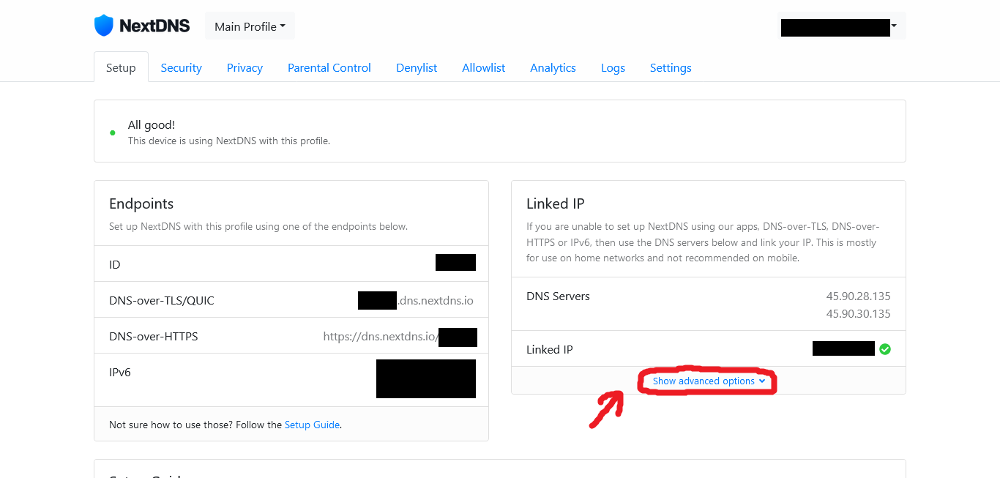
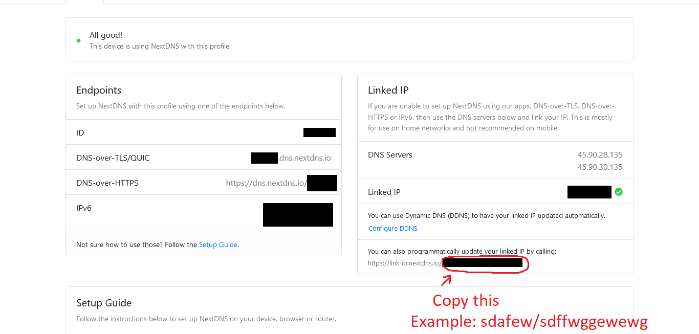
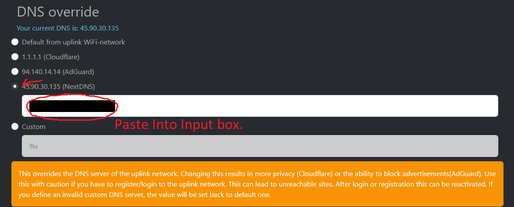

# NextDNS Configuration

This page will tell you how to setup automatic ip linking to your NextDNS account.

To enable NextDNS, you need to create your NextDNS account by going to this [page](https://my.nextdns.io/signup) for long time use (required).

After you created NextDNS account, follow these steps.

## 1. Go to your NextDNS account page by this [link.](https://my.nextdns.io/)

Then click "Show advanced options".

## 2. Copy text under "You can also programmatically update your linked IP by calling:" follow the image.

## 3. Change DNS on [your esp32 router advanced page.](http://192.168.4.1)

On advanced page, under DNS override, change to NextDNS then paste the text into input box.
Then click apply and wait for restart.

That's it.

If you want to check, just go to this [link.](https://my.nextdns.io/)

You will see that your Linked IP is green checked, meaning it matched with your current public IP.